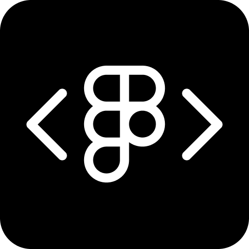

  
  <h1>CodeFig</h1>
  
<em>Run JavaScript inside Figma. Built for interacting with Variables, Styles, Design Systems, and generally with Figma files, nodes programmatically. </em>
  
  

## What is CodeFig?

**CodeFig** is a script runner for Figma, inspired by the [Scripter plugin](https://www.figma.com/community/plugin/757836922707087381/Scripter) by **@rsms**.  
It comes with a curated set of utility scripts covering framing and auto-layout, style and variable batch operations, design-system foundations (grid, typography, spacing, corner radius), and small workflow helpers (e.g. annotations from comments).

Variables are supported as a first-class use case, but CodeFig is intentionally broader than variable tooling.

Scripts run as plain JavaScript in the Figma plugin sandbox.

### Why CodeFig instead of Original Scripter?

**Original Scripter** introduced script-based automation in Figma and remains an excellent minimal tool.  
CodeFig builds on that idea and focuses on scale, structure, and reuse:

- **Broader example set** — layout, styles, variables, and design-system scripts
- **JavaScript scripts** — `.ts` filenames for IDE convenience; runtime is ES2017-style JS the Figma runtime accepts
- **Script organization** — categories, search, import/export
- **No external dependencies** — no CDNs or third-party services; Figma API used only for scripts that need it (e.g. comments-to-annotations)

## Features

**Core**
- Built-in code editor
- Script categories, search, import/export
- Keyboard shortcuts
- Prebuilt utility scripts and libraries
- User scripts with autosave (see note below)
- UI config support (variables, booleans → visual controls)
- Real-time console logging in dev mode

**Notes**
- Only user scripts are auto-saved. Prebuilt scripts are read-only by default — duplicate them to edit and persist changes.
- In dev mode, logs are written in real time to `figma-console.log`, allowing direct debugging without copying errors.

**Bundled examples**
- **Layout & frames:** frame or auto-layout selection, scale or resize, remove unnecessary nesting
- **Styles:** batch rename and replace, duplicate collections, text-to-styles, render-styles overview, detach
- **Variables:** find/replace bindings, batch rename, duplicate collections, inspector
- **Design-system foundations:** grid, typography, spacing, corner radius (responsive scale variables)
- **Other:** annotations generated from Figma comments (API-based)

## Perfect For

Designers and engineers who want repeatable automation for layout, styles, and variables; design-system setup scripts; and a self-contained plugin (no CDNs; Figma API only when needed).

## Quick Start

1. Install from the Figma Community.
2. Open the plugin in any file.
3. Browse the bundled scripts in the sidebar.
4. Run a script via the Run button or `Cmd/Ctrl + R`.
5. Create or extend scripts using **JavaScript** (syntax must be valid JS at run time).

## Development

**Local setup:**  
`npm install` → `npm run dev`

- Watches `src/code.ts`, `src/ui.html`, and `scripts/`
- Starts the local console log server (writes to `figma-console.log`)
- Reload the plugin in Figma to test

**Production build (releases, CI):** `npm run build:production` — runs `tsc` on **`src/code.ts`** only, embeds script **sources** into `dist/ui.html`, and keeps **`manifest.json` free of `localhost`** (enterprise-safe for submission).

**One-off dev build:** `npm run build:dev` — same as production, but adds `http://localhost:8765` to `manifest.json` so the console log bridge can run.

### Scripts

| Command | Description |
|-------|-------------|
| `npm run build:production` | Validation (non-blocking), `tsc`, then `build-scripts.js` without `--dev` — **removes** localhost from the manifest. Use before publishing. |
| `npm run build:dev` | Same, with `--dev` — **adds** localhost for local console forwarding to `figma-console.log`. |
| `npm run dev` | Runs `build:dev`, then watches `src/` and `scripts/`, rebuilds on change, starts the console log server. |
| `npm run validate` | Validate script syntax, imports, and metadata. |
| `npm run clean` | Remove `dist/`. |

**Console logging:**  
During `dev`, plugin and script logs are written to `figma-console.log`. The file is un-ignored so the agent can read it directly. The `prepare` script adds it to `.git/info/exclude` so it is not committed. If you used `npm run dev` or `build:dev`, run **`npm run build:production`** before committing or publishing so `manifest.json` does not retain localhost.

**Project structure**
- `src/` – plugin code and UI
- `scripts/` – utility scripts and shared libraries
- `dist/` – build output (`code.js`, `ui.html` with embedded script bundle)

**Shipped vs dev-only scripts:** The build skips any script file or folder whose name starts with `_` (for example `_auto-layout-all-selected.ts` or `_DEBUG_SCRIPTS/`). Those files stay in the repo for experiments and debugging but are not included in the published plugin.

## Network and Builds

CodeFig is self-contained:
- No CDNs or third-party services
- Uses Figma API only when needed
- No telemetry

`http://localhost:8765` is added only in dev mode for console logging.

## Security & Privacy

- No data collection
- No external dependencies
- Runs entirely in the Figma plugin sandbox

## Bundled Scripts

These are the utility and help scripts included in the build (see **Shipped vs dev-only scripts** under Development). Display names in the plugin follow each file’s title comment.

#### Utility Scripts ####

**Comments to annotations**
Reads Figma comments via the REST API and converts them into annotations.
Useful when duplicating designs across files, as comments don’t carry over. The script preserves comment positions by creating hidden anchors (since comments are usually attached to the root frame, not individual elements).
REQUIRES READ COMMENTS API TOKEN

**Detach styles & variables**
Removes style and/or variable bindings from the current selection. You can choose which types to detach (fill, stroke, effect, typography, etc.) or remove all bindings.

**Duplicate styles group**
Duplicate a styles group, with optionally rebinding its variable bindings to another collection.

**Duplicate variable collection**
Duplicates a variable collection with its metadata and values.

**Frame or auto layout selected**
Wraps (on unwraps) each selected layers in new frames or auto-layout containers individually.

**Remove unnecessary nesting**
Detects and removes redundant wrapper frames (e.g. wrappers with only one child). Optionally normalizes wrappers (e.g. combining padding-x on wrapper 1 and padding-y on wrapper 2 into a single wrapper).

**Rename styles**
Batch-renames styles using find/replace rules, similar to Figma’s batch rename.

**Rename variables**
Batch-renames variables using find/replace rules, similar to Figma’s batch rename.

**Render styles overview**
Generates a visual overview of a defined style group in a frame.
Primarily used to support Replace Styles, which requires all styles to exist in the file. The easiest approach is to generate the overview in the library file and paste it into the target file.

**Replace style variable bindings**
Batch find and replaces variable bindings inside style definitions.

**Replace styles**
Batch finds and rebinds node style assignments to different styles based on name matching and the local style inventory. Style replacement is less smooth than with variables due to limited Figma styles API support, so it requires a two-step approach.

**Replace variables**
Batch finds and rebinds layer variable references or collections to another.

**Scale or resize elements**
Scales or resizes selected nodes by factor, ratio, or explicit dimensions (e.g. resize all selected to 16:9 with a width of 640px).

**Select by styles or variables**
Selects all nodes that use a specific style or variable.

**Text to styles**
Creates text styles from selected text layers, keeping variable bindings (if there is any).

**Variable inspector (WIP)**
Inspects variable bindings and usage details in the file or selection. The goal is to find broken or outdated bindings and disconnected library artifacts. Still in progress due to the complexity.

#### Design System Foundations ####
These enable you to create a highly configurable design system foundation, with as many breakpoints as needed, and to optimize spacing, grid, typography, and corner radius per breakpoint.

**Corner radius**

Creates or updates corner radius variables across breakpoint modes and sets their respective scopes. Highly configurable: set min–max values and define as many steps, increment types, and naming conventions as needed.

**Grid**

Creates or updates layout grid variables across breakpoint modes, sets their respective scopes, creates a grid styles for the setup, and generates preview frames with the grid setup.

**Spacing**

Creates or updates spacing variables across breakpoint modes and sets their respective scopes. Highly configurable: set min–max values per breakpoint and define as many steps, increment types, and naming conventions as needed.

**Typography**
Creates or updates typography variables across breakpoint modes with their respective scopes. and optionally matching text styles. Highly configurable: set min–max values per breakpoint and define as many steps, increment types, and naming conventions as needed.

#### Importable Libraries ####

**@Core Library**
General utility helpers for node traversal, styles, colors, and shared low-level operations.

**@CodeFigUI**
Helpers for building script config UIs inside CodeFig.

**@InfoPanel**
Utilities for showing structured results in the plugin UI.

**@Math Helpers**
Math and scaling helpers for interpolation, easing, ratios, and generated scales.

**@Pattern Matching**
Shared pattern and wildcard matching utilities.

**@Replacement Engine**
Core logic for planning and applying find/replace operations.

**@Styles**
Helpers for discovering, analyzing, and replacing styles.

**@Variables**
Helpers for collections, variables, bindings, and value updates.

**User libraries**  
Create a script and name it with an `@` prefix (e.g. `@My Utils`) to treat it as a library. Libraries are imported by other scripts, not run directly.

## Keyboard Shortcuts

- `Cmd/Ctrl + R` — Run script
- `Cmd/Ctrl + /` — Toggle line comments in the editor
- `Cmd/Ctrl + E` — Export script
- `Cmd/Ctrl + I` — Import script
- `Cmd/Ctrl + N` — New script

User scripts **autosave** after you pause typing (there is no separate Save shortcut).

## Contributing

- Open issues for bugs or proposals
- Submit pull requests
- Share reusable scripts

## License

MIT — free for commercial and non-commercial use.

---

Built for the Figma community.
